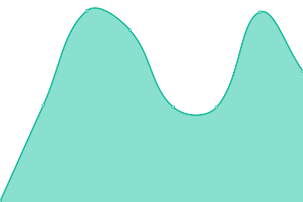

# [📈 Live Status](https://demo.upptime.js.org): <!--live status--> **🟩 All systems operational**

This repository contains the open-source uptime monitor and status page for [Lars](https://aio.sh), powered by [Upptime](https://github.com/upptime/upptime).

With [Upptime](https://upptime.js.org), you can get your own unlimited and free uptime monitor and status page, powered entirely by a GitHub repository. We use [Issues](https://github.com/larsassink/status/issues) as incident reports, [Actions](https://github.com/larsassink/status/actions) as uptime monitors, and [Pages](https://demo.upptime.js.org) for the status page.

<!--start: status pages-->
<!-- This summary is generated by Upptime (https://github.com/upptime/upptime) -->
<!-- Do not edit this manually, your changes will be overwritten -->
<!-- prettier-ignore -->
| URL | Status | History | Response Time | Uptime |
| --- | ------ | ------- | ------------- | ------ |
|  [AIO.SH](https://aio.sh) | 🟩 Up | [aio-sh.yml](https://github.com/larsassink/status/commits/HEAD/history/aio-sh.yml) | 

 239ms
     
 | 

<a href="https://larsassink.github.io/status/history/aio-sh">100.00%</a>
    

|  [ASSIE.IO](https://assie.io) | 🟩 Up | [assie-io.yml](https://github.com/larsassink/status/commits/HEAD/history/assie-io.yml) | 

 481ms
     
 | 

<a href="https://larsassink.github.io/status/history/assie-io">100.00%</a>
    

|  [AIO - ID](https://id.nuc.sh) | 🟩 Up | [aio-id.yml](https://github.com/larsassink/status/commits/HEAD/history/aio-id.yml) | 

 626ms
     
 | 

<a href="https://larsassink.github.io/status/history/aio-id">99.24%</a>
    

|  [AIO - SSO](https://sso.aio.sh) | 🟩 Up | [aio-sso.yml](https://github.com/larsassink/status/commits/HEAD/history/aio-sso.yml) | 

 951ms
     
 | 

<a href="https://larsassink.github.io/status/history/aio-sso">98.93%</a>
    

|  [Registry](https://reg.aio.sh) | 🟩 Up | [registry.yml](https://github.com/larsassink/status/commits/HEAD/history/registry.yml) | 

 518ms
     
 | 

<a href="https://larsassink.github.io/status/history/registry">100.00%</a>
    

|  [Proxy](https://prox.assie.io) | 🟩 Up | [proxy.yml](https://github.com/larsassink/status/commits/HEAD/history/proxy.yml) | 

 544ms
     
 | 

<a href="https://larsassink.github.io/status/history/proxy">100.00%</a>
    

|  [Forge](195.201.193.211) | 🟩 Up | [forge.yml](https://github.com/larsassink/status/commits/HEAD/history/forge.yml) | 

 103ms
     
 | 

<a href="https://larsassink.github.io/status/history/forge">99.75%</a>
    

<!--end: status pages-->

[**Visit our status website →**](https://demo.upptime.js.org)

## 📄 License

- Powered by: [Upptime](https://github.com/upptime/upptime)
- Code: [MIT](./LICENSE) © [Anand Chowdhary](https://anandchowdhary.com), supported by [Pabio](https://pabio.com)
- Data in the `./history` directory: [Open Database License](https://opendatacommons.org/licenses/odbl/1-0/)
